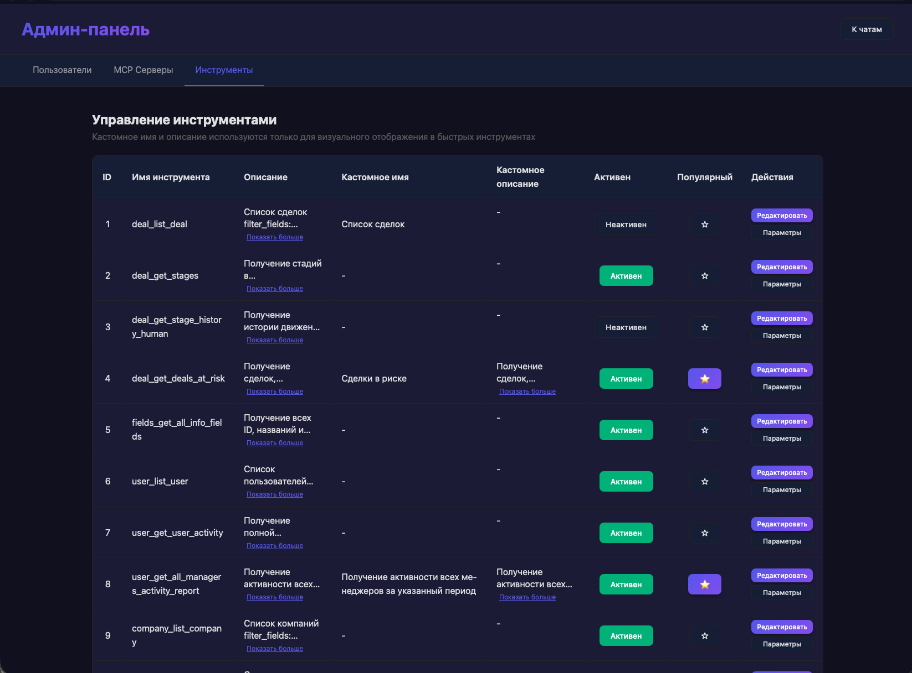

<div align="center">

# B24 Analytics Hub

### Веб-приложение для аналитики данных из Bitrix24 с чатом LLM+MCP

<p align="center">
  
</p>

<p align="center">
  <a href="#функциональность">🚀 Возможности</a> · 
  <a href="#запуск">📦 Установка</a> · 
  <a href="architecture.md">📚 Документация</a> · 
  <a href="#технологии">⚙️ Технологии</a>
</p>

</div>

<br />


## Функциональность

- **Чат с LLM**: интеллектуальный ассистент с доступом к инструментам Bitrix24 через MCP
- **Прямой вызов инструментов**: кнопки для быстрого вызова популярных MCP инструментов
- **Система авторизации**: JWT токены с автоматическим обновлением
- **Админ-панель**: управление пользователями, MCP серверами и инструментами
- **Управление инструментами**: добавление, редактирование, вкл/выкл инструментов, отметка популярных инструментов изменением названий и описаний для визуального отображения в быстрых инструментах, редактирование названий параметров, скрытие параметров от пользователя визуально
- **Адаптивный дизайн**: стилизация в духе Bitrix24, поддержка мобильных устройств

## Технологии
Проект предназначен для развертывания через docker compose.
### Backend
- FastAPI
- SQLAlchemy 2.0 (async)
- SQLite с aiosqlite
- OpenAI API
- langchain-mcp-adapters для интеграции с MCP серверами

### Frontend
- React 18 + TypeScript
- Vite
- React Router
- Axios

## Запуск

1. Установить зависимости через uv:
```bash
uv sync
```

2. Создать файл `.env` на основе `.env.example`:
```bash
cp .env.example .env
```

3. Заполнить `.env` файл:
- `OPENAI_API_KEY` - API ключ OpenAI
- `JWT_SECRET_KEY` - секретный ключ для JWT (можно сгенерировать: `openssl rand -hex 32`)
- `JWT_REFRESH_SECRET_KEY` - секретный ключ для refresh токенов (можно сгенерировать: `openssl rand -hex 32`)

4. Запустите docker compose:
```bash
docker compose up -d --build
```

Приложение будет доступно по адресу: http://localhost:3001

## Локальная разработка

Для разработки без Docker выполните следующие шаги:

### Требования
- Python 3.12+
- Node.js 18+
- uv (менеджер пакетов Python)
- npm или yarn

### Backend

1. Перейдите в директорию backend:
```bash
cd backend
```

2. Установите зависимости через uv:
```bash
uv sync
```

3. Создайте файл `.env` в корне проекта (на основе `.env.example` если есть) и заполните переменные окружения:
- `OPENAI_API_KEY` - API ключ OpenAI
- `JWT_SECRET_KEY` - секретный ключ для JWT (можно сгенерировать: `openssl rand -hex 32`)
- `JWT_REFRESH_SECRET_KEY` - секретный ключ для refresh токенов (можно сгенерировать: `openssl rand -hex 32`)
- `DATABASE_URL` - URL базы данных (по умолчанию: `sqlite+aiosqlite:///./b24_analytics.db`)
- `MCP_BITRIX24_URL` - URL MCP сервера Bitrix24 (по умолчанию: `http://0.0.0.0:8000/mcp`)
- `MCP_BITRIX24_NAME` - имя MCP сервера (по умолчанию: `bitrix24-main`)
- `MCP_BITRIX24_TRANSPORT` - транспорт MCP (по умолчанию: `streamable_http`)
- `MCP_BITRIX24_AUTH_TOKEN` - токен авторизации MCP (если требуется)

4. Примените миграции базы данных:
```bash
uv run alembic upgrade head
```

5. Создайте первого администратора:
```bash
uv run python create_admin.py
```

6. Запустите backend сервер:
```bash
uv run uvicorn app.main:app --host 0.0.0.0 --port 8001 --reload
```

Backend будет доступен по адресу: http://localhost:8001

### Frontend

1. Перейдите в директорию frontend:
```bash
cd frontend
```

2. Установите зависимости:
```bash
npm install
```

3. Создайте файл `.env` в директории frontend (опционально, если нужны кастомные настройки):
- `VITE_BACKEND_URL` - URL backend сервера (по умолчанию: `http://localhost:8001`)
- `VITE_WS_URL` - URL WebSocket (по умолчанию: `ws://localhost:8001/ws`)

4. Запустите dev сервер:
```bash
npm run dev
```

Frontend будет доступен по адресу: http://localhost:3000

### Важно

- Убедитесь, что MCP сервер Bitrix24 запущен и доступен по адресу, указанному в `MCP_BITRIX24_URL`
- Backend должен быть запущен перед frontend, так как frontend делает запросы к API
- Для разработки используется режим `--reload` для автоматической перезагрузки при изменении кода

## Пример запроса в чат


## Пример работы с инструментом


## MCP Сервер Bitrix24

Приложение подключается к MCP серверу Bitrix24:
- URL: `http://0.0.0.0:8000/mcp`
- Транспорт: `streamable_http`
- Имя сервера: `bitrix24-main`

Убедитесь, что MCP сервер Bitrix24 запущен перед использованием приложения.

## Разработка

Проект использует `uv` для управления Python зависимостями и `npm` для управления зависимостями frontend.

### Структура проекта

- `backend/` - FastAPI приложение с API и бизнес-логикой
- `frontend/` - React приложение с TypeScript
- `backend/alembic/` - миграции базы данных
- `backend/app/` - основной код backend приложения
  - `api/` - API роутеры
  - `models/` - модели базы данных
  - `services/` - бизнес-логика
  - `config.py` - конфигурация приложения
  - `database.py` - настройка базы данных

Подробнее о структуре проекта см. [architecture.md](architecture.md)

## Лицензия

MIT

