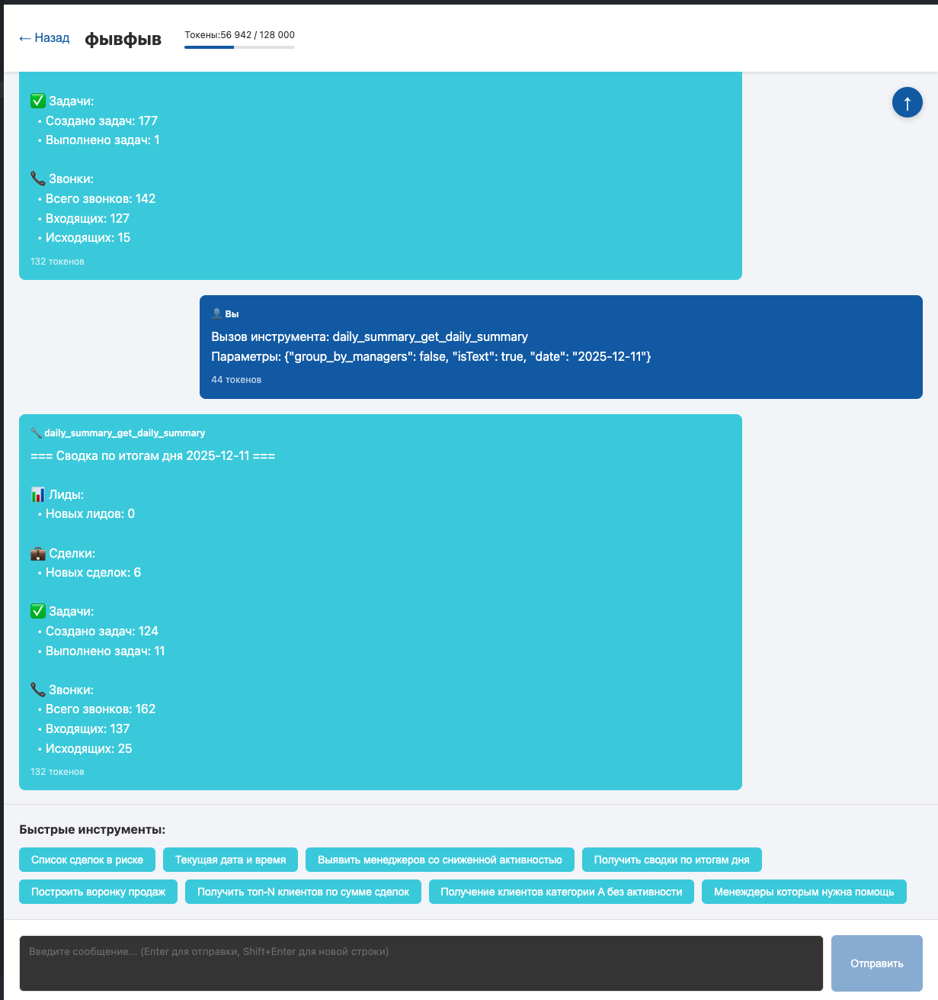

# B24 Analytics Hub

Веб-приложение для аналитики данных из Bitrix24 с чатом LLM+MCP.

## Функциональность

- **Чат с LLM**: интеллектуальный ассистент с доступом к инструментам Bitrix24 через MCP
- **Прямой вызов инструментов**: кнопки для быстрого вызова популярных MCP инструментов
- **Система авторизации**: JWT токены с автоматическим обновлением
- **Админ-панель**: управление пользователями, MCP серверами и инструментами
- **Адаптивный дизайн**: стилизация в духе Bitrix24, поддержка мобильных устройств

## Технологии
проект прежнозначен для развертывания через dokploy
### Backend
- FastAPI
- SQLAlchemy 2.0 (async)
- SQLite с aiosqlite
- OpenAI API
- langchain-mcp-adapters для интеграции с MCP серверами

### Frontend
- React 18 + TypeScript
- Vite
- React Router
- Axios

## Установка

### Backend

1. Установить зависимости через uv:
```bash
uv sync
```

2. Создать файл `.env` на основе `.env.example`:
```bash
cp backend/.env.example backend/.env
```

3. Заполнить `.env` файл:
- `OPENAI_API_KEY` - API ключ OpenAI
- `JWT_SECRET_KEY` - секретный ключ для JWT (можно сгенерировать: `openssl rand -hex 32`)
- `JWT_REFRESH_SECRET_KEY` - секретный ключ для refresh токенов (можно сгенерировать: `openssl rand -hex 32`)

4. Инициализировать базу данных:
```bash
cd backend
uv run alembic revision --autogenerate -m "Initial migration"
uv run alembic upgrade head
```

5. Создать первого администратора:
```bash
cd backend
uv run python create_admin.py
```

6. Запустить сервер:
```bash
cd backend
uv run uvicorn app.main:app --reload --host 0.0.0.0 --port 8001
```

### Frontend

1. Установить зависимости:
```bash
cd frontend
npm install
```

2. Создать файл `.env`:
```bash
cp .env.example .env
```

3. Запустить dev-сервер:
```bash
npm run dev
```

Приложение будет доступно по адресу: http://localhost:3000

## Пример запроса в чат



## MCP Сервер Bitrix24

Приложение подключается к MCP серверу Bitrix24:
- URL: `http://0.0.0.0:8000/mcp`
- Транспорт: `streamable_http`
- Имя сервера: `bitrix24-main`

Убедитесь, что MCP сервер Bitrix24 запущен перед использованием приложения.

## Структура проекта

```
b24-analytics-hub/
├── backend/           # FastAPI приложение
│   ├── app/
│   │   ├── api/      # API endpoints
│   │   ├── models/   # SQLAlchemy модели
│   │   └── services/ # Бизнес-логика
│   ├── alembic/      # Миграции БД
│   └── tests/
├── frontend/         # React приложение
│   └── src/
│       ├── components/
│       ├── services/
│       ├── hooks/
│       └── styles/
└── pyproject.toml    # Python зависимости
```

## Разработка

Проект использует `uv` для управления Python зависимостями.

## Лицензия

MIT

